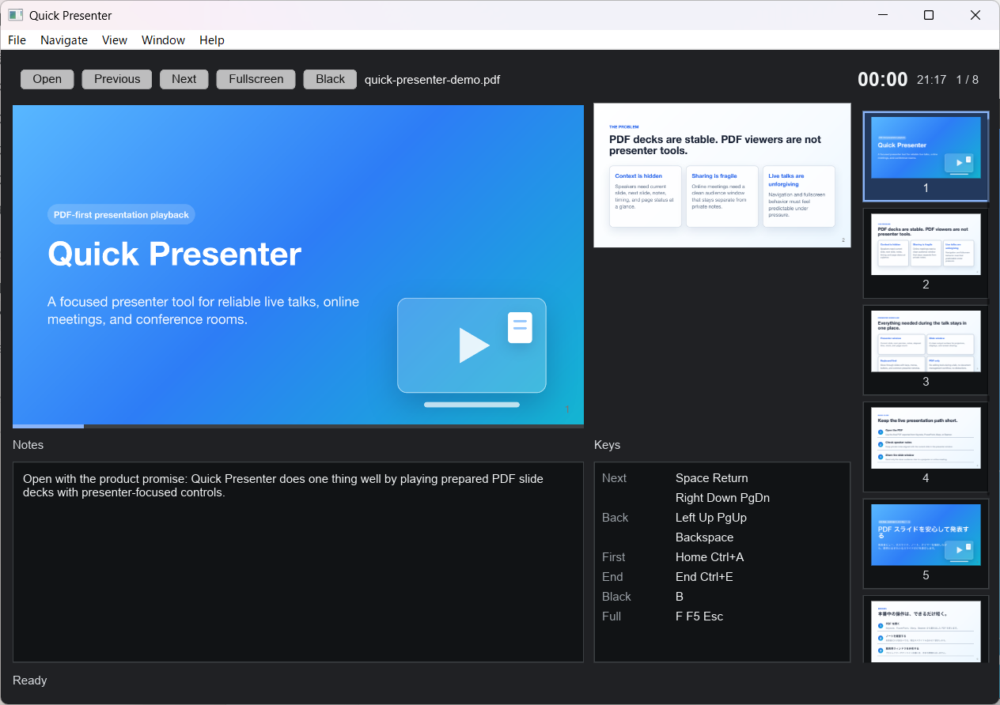
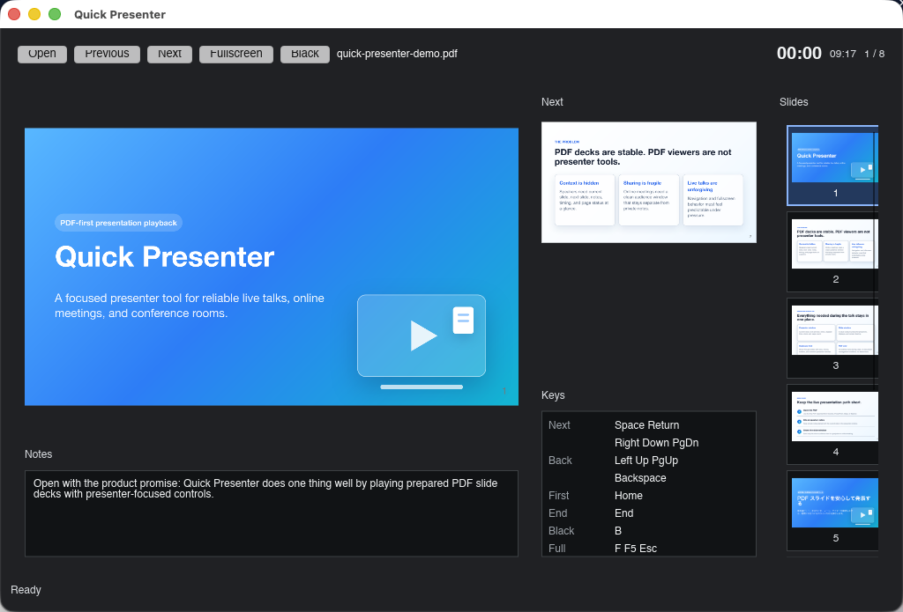
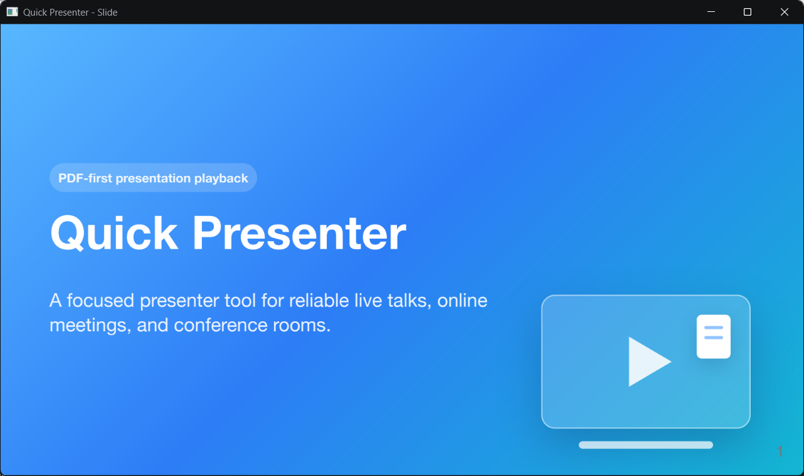
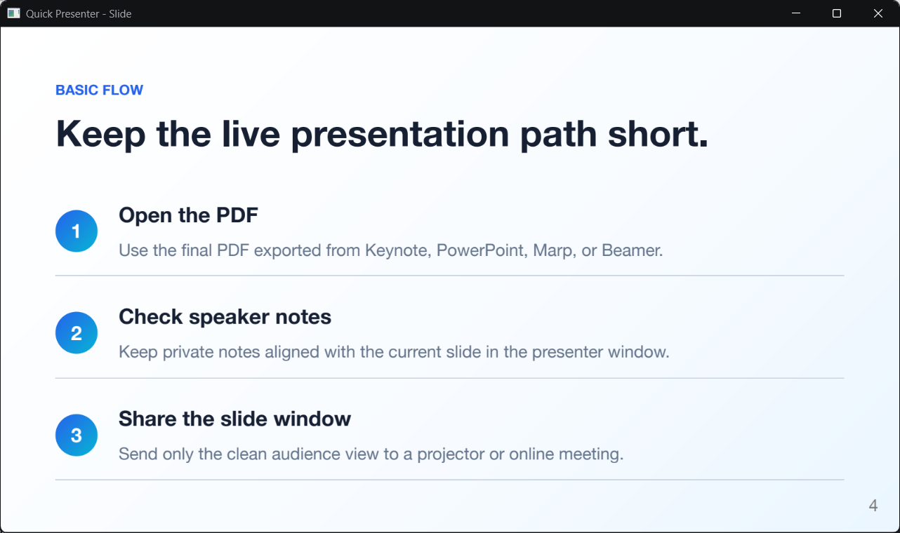
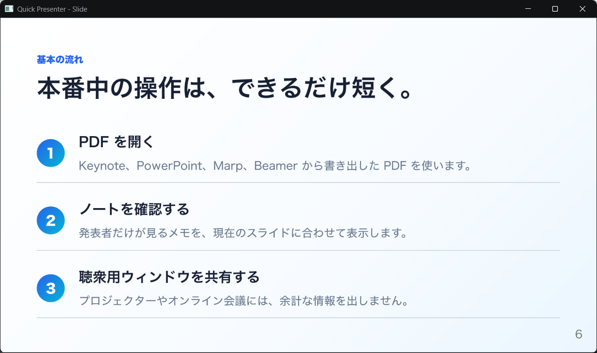
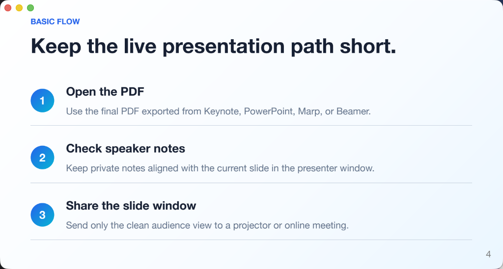
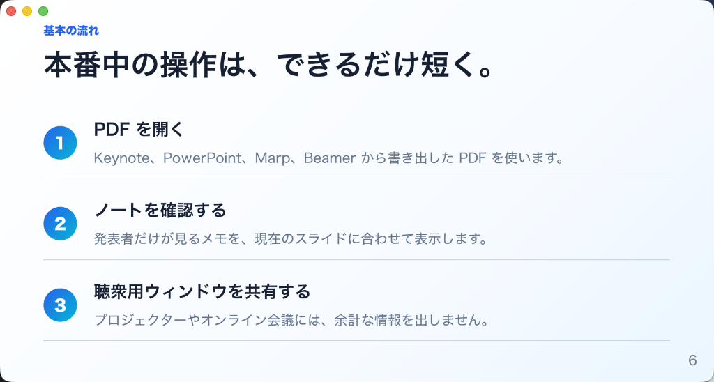

# Quick Presenter

[Website](https://koichiro.github.io/quick-presenter/) ·
[Downloads](https://github.com/koichiro/quick-presenter/releases) ·
[Privacy](https://koichiro.github.io/quick-presenter/privacy/)

[](https://github.com/koichiro/quick-presenter/actions/workflows/ci.yml)
[](https://github.com/koichiro/quick-presenter/actions/workflows/build-binaries.yml)


[](LICENSE)


Quick Presenter is a lightweight cross-platform presenter tool for PDF slide
decks, built for academic talks, research presentations, technical conferences,
and online presentations over tools such as Zoom and Google Meet.

Quick Presenter focuses on one job: open a PDF slide deck and help the speaker
present it reliably. It is not a slide editor, a deck authoring tool, or a
document management app.

## Core Components

- [PDFium](https://pdfium.googlesource.com/pdfium/), accessed through
  [`pdfium-render`](https://crates.io/crates/pdfium-render), loads and renders
  PDF slide decks.
- [Slint](https://slint.dev/) provides the cross-platform user interface for
  presenter controls and slide output.

## Demo


## Screenshots

### Presenter Window





### Slide Window












The screenshots use the repository-owned sample deck in
[docs/samples/quick-presenter-demo.md](docs/samples/quick-presenter-demo.md).

## What Quick Presenter Solves

Many speakers create slides in a separate authoring tool, then export the final
deck to PDF. PDF is stable and portable, but ordinary PDF viewers are not
designed around live presentation workflows.

Quick Presenter provides a focused playback experience:

- A presenter window with the current slide, next slide preview, speaker notes,
  elapsed time, clock, and page status.
- A separate slide window for audience-facing output.
- Keyboard-first navigation that works well with presentation remotes.
- A compact PDF-only workflow that avoids editor complexity during a talk.

The goal is to make presenting a prepared PDF feel predictable, especially when
switching between in-person talks, conference rooms, and online meetings.

## PDF Authoring Tools

Quick Presenter does not create or edit slide decks. It presents PDF files
exported from authoring tools such as:

| Tool | Notes |
| --- | --- |
| Keynote | Export the finished deck to PDF before presenting. |
| PowerPoint | Export the finished deck to PDF before presenting. |
| Google Slides | Export the finished deck to PDF before presenting. |
| [Marp](https://marp.app/) | OSS Markdown-based slide authoring; exported PDF speaker notes are supported in the presenter window. |
| [LaTeX Beamer](https://ctan.org/pkg/beamer) | OSS LaTeX class for PDF-first slide decks; `pdfcomment` annotations can provide speaker notes in the presenter window. |

The supported input remains the exported PDF, not the source project from any
authoring tool. Representative exports from these tools are covered by the
[PDF export compatibility fixtures](docs/PDF_COMPATIBILITY.md).

### Beamer speaker notes

Beamer's native `\note` command typesets separate note pages or a second-screen
layout; it does not store notes as metadata on the original slide page. To make
the same note available to Quick Presenter, add a transparent PDF `Text`
annotation with the [`pdfcomment`](https://ctan.org/pkg/pdfcomment) package:

```tex
\usepackage{pdfcomment}

\newcommand{\presenternote}[1]{%
  \note{#1}%
  \pdfcomment[icon=Note,opacity=0,author={Quick Presenter}]{#1}%
}
```

Use `\presenternote` inside a frame in place of `\note`:

```tex
\begin{frame}{Example}
  Slide content.
  \presenternote{Explain the important point on this slide.}
\end{frame}
```

Quick Presenter reads the annotation text into the presenter window and does
not render its icon onto the audience slide. A tested source and generated PDF
are available in
[`tests/fixtures/latex-beamer.tex`](tests/fixtures/latex-beamer.tex) and the
[PDF compatibility notes](docs/PDF_COMPATIBILITY.md).

## Current Capabilities

- Open prepared PDF slide decks from the UI or at startup.
- Automatically reload the active PDF after a valid external file change while
  keeping the last good version visible during incomplete or failed saves.
- Present with separate speaker-facing and audience-facing windows.
- Keep presenter context visible through page status, next-slide preview,
  speaker notes, timer, and clock.
- Support keyboard-first navigation, including common presenter remote keys.
- Bundle the PDF runtime in packaged builds for predictable playback.

## Basic Usage

Run the app:

```sh
cargo run --bin quick-presenter
```

On orderly exit, Quick Presenter remembers the active PDF and the slide window's
normal size and position. The next launch reopens that PDF at its first page in
windowed mode. An explicit startup PDF takes precedence. Missing or inaccessible
PDFs leave the app open so you can select another file. Display changes use an
available-screen fallback; Wayland leaves window placement to the compositor.

Headless and GUI smoke modes bypass this restoration and never read or save the
startup record. See [startup restoration](docs/SLIDE_WINDOW_PLACEMENT.md) and
[privacy and reset instructions](docs/PRIVACY.md).

Open a PDF at startup:

```sh
cargo run --bin quick-presenter -- --pdf path/to/slides.pdf
```

For development verification, this repository includes a small fixture PDF:

```sh
cargo run --bin quick-presenter -- --pdf tests/fixtures/marp-speaker-notes.pdf
```

The README screenshot deck can also be opened directly:

```sh
cargo run --bin quick-presenter -- --pdf docs/samples/quick-presenter-demo.pdf
```

The active PDF is watched automatically. Saving it in place or replacing it
atomically refreshes the deck while preserving the current page when possible.
No hot reload setting is required.

The Cargo package and GUI executable are both named `quick-presenter`. The short
`qp` command name is reserved for a future automation-oriented CLI entrypoint.

Keyboard controls are documented in [docs/KEYBOARD.md](docs/KEYBOARD.md).
Recent-file privacy behavior is documented in
[docs/PRIVACY.md](docs/PRIVACY.md).
Packaged app diagnostic logs are documented in
[docs/PACKAGING.md](docs/PACKAGING.md#diagnostic-logs).

## Build and Development

Install Rust stable and Python 3, then fetch the local PDFium binary used for
development:

```sh
python3 scripts/fetch_pdfium.py
```

CI and release packaging fetch PDFium with `--clean` so extraction starts from a
clean output directory. See [docs/PACKAGING.md](docs/PACKAGING.md) for the
release-oriented PDFium fetch requirements.

Build the app:

```sh
cargo build --bin quick-presenter
```

Run the standard checks:

```sh
cargo fmt --check
cargo check
cargo test
```

Run the dependency advisory audit before release validation:

```sh
scripts/audit_deps.sh
```

Coverage is measured with:

```sh
scripts/coverage.sh
```

Detailed packaging, release, keyboard, and speaker-note behavior is documented
under [docs/](docs/).

## Releases

Quick Presenter is an OSS project focused on reliable PDF presentation
playback. Windows v1.0.0 is distributed exclusively through Microsoft Store;
the signed/notarized macOS package and Linux package are published through
GitHub Releases. Download and launch steps are documented in
[docs/RELEASE.md](docs/RELEASE.md).

Packaging and signing details for maintainers are documented in
[docs/PACKAGING.md](docs/PACKAGING.md).

## Roadmap

Quick Presenter is built around one core promise: dependable PDF playback for
live talks. The roadmap keeps that promise first, then expands toward smoother
delivery and AI-assisted presentation workflows.

- **v1.0.0: Reliable desktop presentation playback.** Quick Presenter should
  cover the essential presenter workflow and provide installable packages for
  macOS, Windows, and Linux.
- **v1.5.0: More polished live delivery.** Presenter-focused enhancements such
  as pointer tools should make talks easier to run, with donation-friendly
  distribution through desktop app stores.
- **v2.0.0: AI-centric presentation operations.** Quick Presenter should grow a
  CLI interface and AI-friendly workflows while continuing to treat PDF as the
  presentation source of truth.

## Related Projects

- [Présentation.app](https://iihm.imag.fr/blanch/software/osx-presentation/) is
  a similar PDF presentation tool for macOS.

## Contributing

Contributions are welcome.

Before starting broad changes, please open or join an issue so the scope can
stay clear. Quick Presenter prioritizes predictable live presentation behavior,
so changes should keep PDF playback reliable and avoid turning the app into a
slide editor.

Useful starting points:

- Read [AGENTS.md](AGENTS.md) for repository conventions.
- Read the architecture notes in [docs/ARCHITECTURE.md](docs/ARCHITECTURE.md).
- Read the current and target PDFium trust boundaries in
  [docs/PDF_RENDERING_SECURITY.md](docs/PDF_RENDERING_SECURITY.md).
- Check keyboard behavior in [docs/KEYBOARD.md](docs/KEYBOARD.md).
- Check speaker-note behavior in [docs/NOTES.md](docs/NOTES.md).
- Run `cargo fmt --check`, `cargo check`, and `cargo test` before submitting a
  pull request.

## License

Quick Presenter is licensed under the GNU General Public License v3.0 only.
See [LICENSE](LICENSE).

Paid distribution is allowed under the GPL, but every binary distribution must
preserve the recipient's GPL freedoms and provide the corresponding source code
for that exact build.

Quick Presenter uses PDFium through `pdfium-render`. Packaged builds that bundle
PDFium must include PDFium and third-party component license files. See
[pdfium/LICENSE](pdfium/LICENSE) and [docs/PACKAGING.md](docs/PACKAGING.md).
