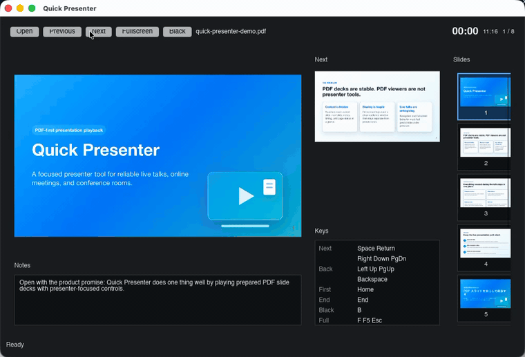
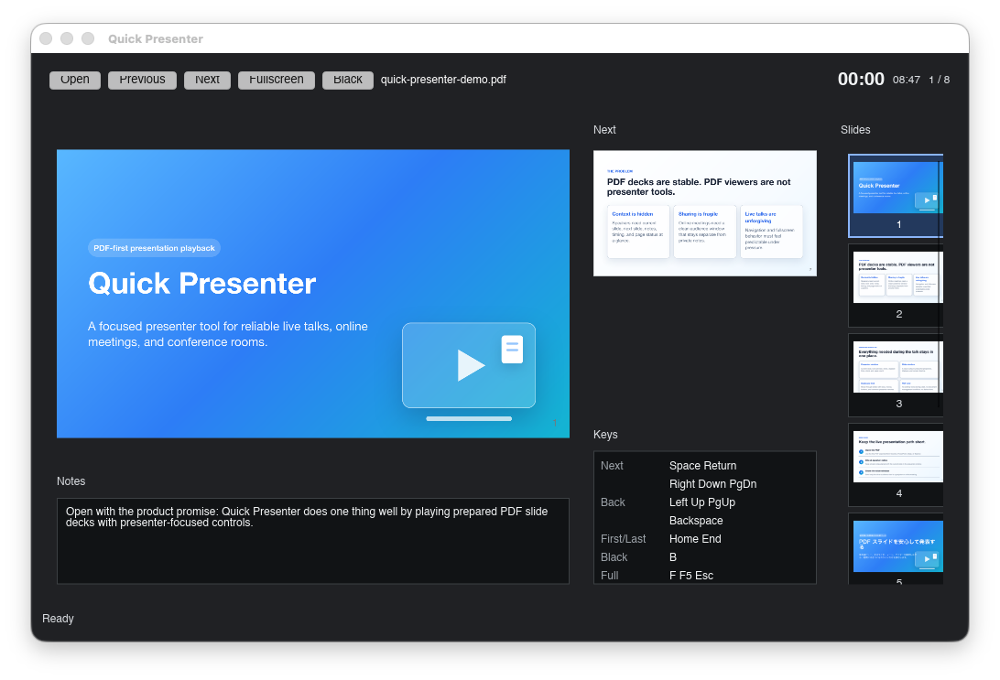
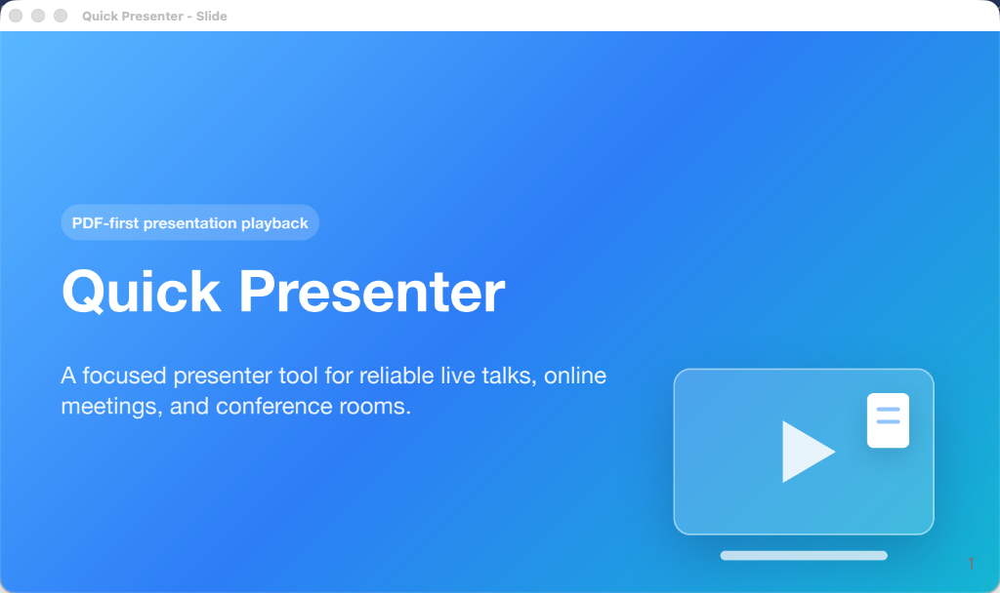
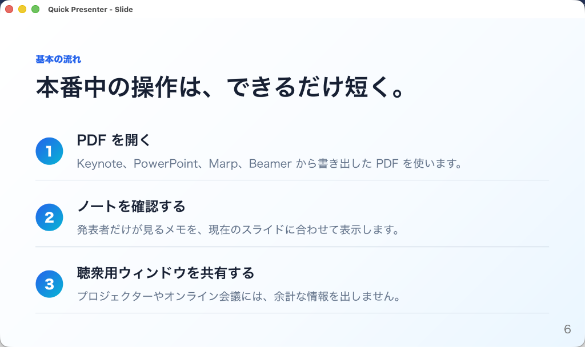

# Quick Presenter

[](https://github.com/koichiro/quick-presenter/actions/workflows/ci.yml)
[](https://github.com/koichiro/quick-presenter/actions/workflows/build-binaries.yml)


[](LICENSE)


Quick Presenter is a lightweight cross-platform presenter tool for PDF slide
decks, built for academic talks, research presentations, technical conferences,
and online presentations over tools such as Zoom and Google Meet.

Quick Presenter focuses on one job: open a PDF slide deck and help the speaker
present it reliably. It is not a slide editor, a deck authoring tool, or a
document management app.

## Demo



## Screenshots

### Presenter Window



### Slide Window






The screenshots use the repository-owned sample deck in
[docs/samples/quick-presenter-demo.md](docs/samples/quick-presenter-demo.md).

## What Quick Presenter Solves

Many speakers create slides in a separate authoring tool, then export the final
deck to PDF. PDF is stable and portable, but ordinary PDF viewers are not
designed around live presentation workflows.

Quick Presenter provides a focused playback experience:

- A presenter window with the current slide, next slide preview, speaker notes,
  elapsed time, clock, and page status.
- A separate slide window for audience-facing output.
- Keyboard-first navigation that works well with presentation remotes.
- A compact PDF-only workflow that avoids editor complexity during a talk.

The goal is to make presenting a prepared PDF feel predictable, especially when
switching between in-person talks, conference rooms, and online meetings.

## PDF Authoring Tools

Quick Presenter does not create or edit slide decks. It presents PDF files
exported from authoring tools such as:

| Tool | Notes |
| --- | --- |
| Keynote | Export the finished deck to PDF before presenting. |
| PowerPoint | Export the finished deck to PDF before presenting. |
| Google Slides | Export the finished deck to PDF before presenting. |
| [Marp](https://marp.app/) | OSS Markdown-based slide authoring; exported PDF speaker notes are supported in the presenter window. |
| [LaTeX Beamer](https://ctan.org/pkg/beamer) | OSS LaTeX class for PDF-first slide decks. |

The supported input remains the exported PDF, not the source project from any
authoring tool.

## Current Capabilities

- Open prepared PDF slide decks from the UI or at startup.
- Present with separate speaker-facing and audience-facing windows.
- Keep presenter context visible through page status, next-slide preview,
  speaker notes, timer, and clock.
- Support keyboard-first navigation, including common presenter remote keys.
- Bundle the PDF runtime in packaged builds for predictable playback.

## Basic Usage

Run the app:

```sh
cargo run --bin qp
```

Open a PDF at startup:

```sh
cargo run --bin qp -- --pdf path/to/slides.pdf
```

For development verification, this repository includes a small fixture PDF:

```sh
cargo run --bin qp -- --pdf tests/fixtures/marp-speaker-notes.pdf
```

The README screenshot deck can also be opened directly:

```sh
cargo run --bin qp -- --pdf docs/samples/quick-presenter-demo.pdf
```

The Cargo package remains `quick-presenter`, while the development executable is
named `qp`.

Keyboard controls are documented in [docs/KEYBOARD.md](docs/KEYBOARD.md).
Recent-file privacy behavior is documented in
[docs/PRIVACY.md](docs/PRIVACY.md).

## Build and Development

Install Rust stable and Python 3, then fetch the local PDFium binary used for
development:

```sh
python3 scripts/fetch_pdfium.py
```

CI and release packaging fetch PDFium with `--clean` so extraction starts from a
clean output directory. See [docs/PACKAGING.md](docs/PACKAGING.md) for the
release-oriented PDFium fetch requirements.

Build the app:

```sh
cargo build --bin qp
```

Run the standard checks:

```sh
cargo fmt --check
cargo check
cargo test
```

Coverage is measured with:

```sh
scripts/coverage.sh
```

Detailed packaging, release, keyboard, and speaker-note behavior is documented
under [docs/](docs/).

## Releases

Quick Presenter is an OSS project focused on reliable PDF presentation
playback. Download and launch steps for packaged artifacts are documented in
[docs/RELEASE.md](docs/RELEASE.md).

Packaging and signing details for maintainers are documented in
[docs/PACKAGING.md](docs/PACKAGING.md).

## Roadmap

The roadmap is intentionally guided by the core product scope: stable PDF
presentation playback. Future work should make live talks more predictable,
reduce setup risk, and improve presenter confidence without turning Quick
Presenter into a slide editor or document management system.

## Related Projects

- [Présentation.app](https://iihm.imag.fr/blanch/software/osx-presentation/) is
  a similar PDF presentation tool for macOS.

## Contributing

Contributions are welcome.

Before starting broad changes, please open or join an issue so the scope can
stay clear. Quick Presenter prioritizes predictable live presentation behavior,
so changes should keep PDF playback reliable and avoid turning the app into a
slide editor.

Useful starting points:

- Read [AGENTS.md](AGENTS.md) for repository conventions.
- Read the architecture notes in [docs/ARCHITECTURE.md](docs/ARCHITECTURE.md).
- Check keyboard behavior in [docs/KEYBOARD.md](docs/KEYBOARD.md).
- Check speaker-note behavior in [docs/NOTES.md](docs/NOTES.md).
- Run `cargo fmt --check`, `cargo check`, and `cargo test` before submitting a
  pull request.

## License

Quick Presenter is licensed under the GNU General Public License v3.0 or later.
See [LICENSE](LICENSE).

Paid distribution is allowed under the GPL, but every binary distribution must
preserve the recipient's GPL freedoms and provide the corresponding source code
for that exact build.

Quick Presenter uses PDFium through `pdfium-render`. Packaged builds that bundle
PDFium must include PDFium and third-party component license files. See
[pdfium/LICENSE](pdfium/LICENSE) and [docs/PACKAGING.md](docs/PACKAGING.md).
